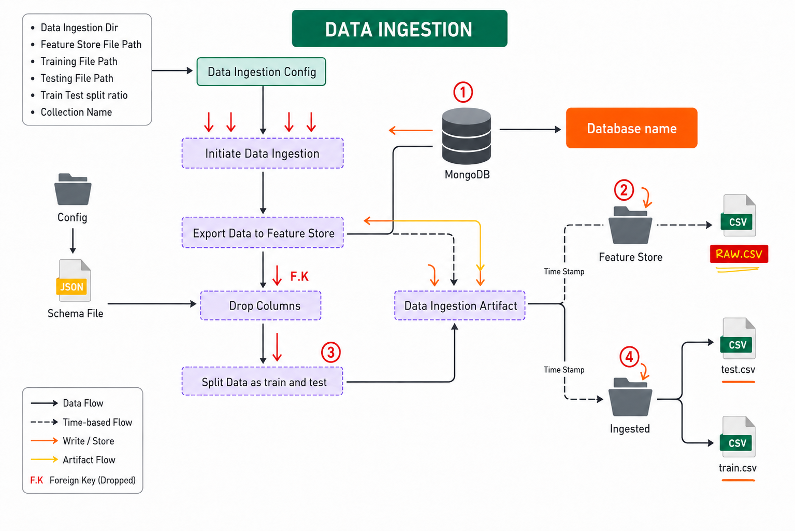
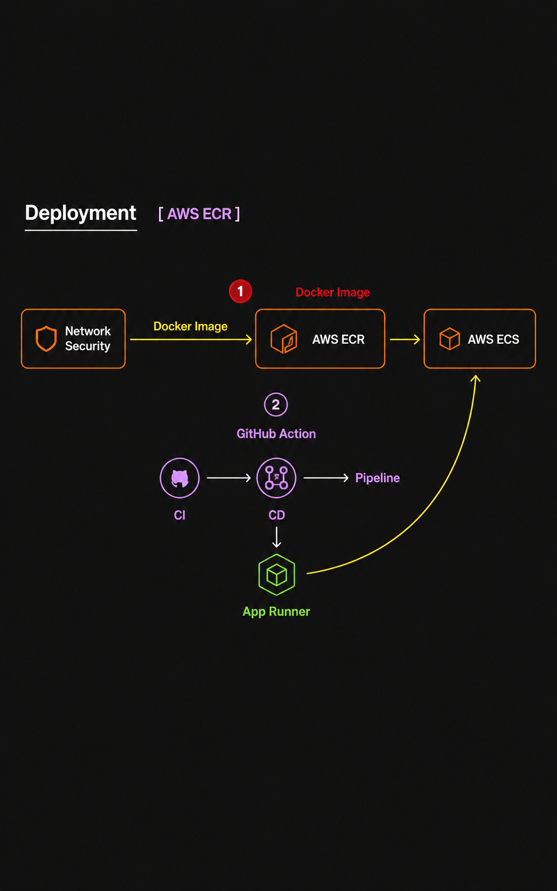

# Network Security — Phishing URL Detection System

An end-to-end machine learning system that detects phishing websites by extracting 30 security features from URLs and classifying them using ensemble models. The project implements a full MLOps lifecycle — from data ingestion off MongoDB Atlas through model training with experiment tracking to containerised deployment on AWS.

> **Live on AWS** — deployed via GitHub Actions CI/CD → ECR → EC2.

---

## High-Level Architecture


---

## Table of Contents

- [Project Structure](#project-structure)
- [ML Pipeline](#ml-pipeline)
  - [Data Ingestion](#1-data-ingestion)
  - [Data Validation](#2-data-validation)
  - [Data Transformation](#3-data-transformation)
  - [Model Training](#4-model-training)
- [Feature Engineering — URL Feature Extractor](#feature-engineering--url-feature-extractor)
- [API Reference](#api-reference)
- [Experiment Tracking](#experiment-tracking)
- [AWS Deployment Architecture](#aws-deployment-architecture)
- [CI/CD Pipeline](#cicd-pipeline)
- [Setup & Installation](#setup--installation)
- [Environment Variables](#environment-variables)
- [Tech Stack](#tech-stack)

---

## Project Structure

```
NetworkSecurity/
├── .github/workflows/
│   └── main.yml                    # CI/CD — GitHub Actions workflow
├── networksecurity/                # Core Python package
│   ├── cloud/
│   │   └── s3_syncer.py            # AWS S3 sync utility (upload/download artifacts)
│   ├── components/
│   │   ├── data_ingestion.py       # MongoDB → DataFrame → train/test CSV split
│   │   ├── data_validation.py      # Schema validation + KS-test drift detection
│   │   ├── data_transformation.py  # KNN imputation pipeline → .npy arrays
│   │   └── model_trainer.py        # GridSearchCV over 5 classifiers + MLflow logging
│   ├── constants/
│   │   └── training_pipeline/      # All pipeline hyperparams & path constants
│   ├── entity/
│   │   ├── config_entity.py        # Config dataclasses per pipeline stage
│   │   └── artifact_entity.py      # Artifact dataclasses (paths + metrics)
│   ├── exception/
│   │   └── exception.py            # Custom exception with file/line tracing
│   ├── logging/
│   │   └── logger.py               # Timestamped file-based logging
│   ├── pipeline/
│   │   └── training_pipeline.py    # Orchestrates all stages + S3 sync
│   └── utils/
│       ├── main_utils/utils.py     # YAML I/O, pickle, numpy, GridSearchCV evaluation
│       ├── ml_utils/
│       │   ├── metric/
│       │   │   └── classification_metric.py  # F1, Precision, Recall scorer
│       │   └── model/
│       │       └── estimator.py    # NetworkModel wrapper (preprocessor + model)
│       └── url_feature_extractor.py # Extracts 30 phishing features from any URL
├── data_schema/
│   └── schema.yaml                 # 30-column schema definition with dtypes
├── Network_Data/
│   └── phisingData.csv             # Raw dataset (11,055 samples, 31 columns)
├── valid_data/
│   └── test.csv                    # Hold-out validation data
├── templates/
│   ├── predict_url.html            # URL scanner UI (dark-themed, SVG icons)
│   └── table.html                  # Batch prediction results renderer
├── final_model/
│   ├── model.pkl                   # Production classifier (pickle)
│   └── preprocessor.pkl            # Production KNN imputer pipeline (pickle)
├── app.py                          # FastAPI application (4 routes)
├── main.py                         # Standalone pipeline runner (CLI)
├── push_data.py                    # CSV → MongoDB Atlas bulk inserter
├── Dockerfile                      # Python 3.10-slim + awscli
├── setup.py                        # Package metadata (setuptools)
├── requirements.txt                # Pinned dependencies
└── .env                            # Secrets (git-ignored)
```

---

## ML Pipeline

The training pipeline is orchestrated by [`TrainingPipeline.run_pipeline()`](networksecurity/pipeline/training_pipeline.py) and executes four stages sequentially. Each stage produces a typed artifact dataclass that feeds into the next.

### 1. Data Ingestion



| Detail | Value |
|---|---|
| **Source** | MongoDB Atlas (`ANAND_DB.NetworkData`) |
| **Process** | `export_collection_as_dataframe()` → replace `"na"` strings with `NaN` → export to feature store CSV → 80/20 train-test split via `train_test_split()` |
| **Split Ratio** | 0.2 (configurable in constants) |
| **Output Artifact** | `DataIngestionArtifact(trained_file_path, test_file_path)` |

### 2. Data Validation


| Detail | Value |
|---|---|
| **Schema** | Loaded from `data_schema/schema.yaml` — defines 30 feature columns + 1 target (`Result`), all `int64` |
| **Column Check** | Validates that the ingested DataFrame column count matches the schema |
| **Drift Detection** | Kolmogorov-Smirnov two-sample test (`scipy.stats.ks_2samp`) per column with `threshold=0.05`. A per-column drift report (`p_value`, `drift_status`) is written to `drift_report/report.yaml` |
| **Output Artifact** | `DataValidationArtifact(validation_status, valid_train_file_path, valid_test_file_path, drift_report_file_path, ...)` |

### 3. Data Transformation


| Detail | Value |
|---|---|
| **Target Encoding** | `Result` column: `-1 → 0` (binary remap) |
| **Imputation** | `KNNImputer(missing_values=NaN, n_neighbors=3, weights='uniform')` wrapped in a `sklearn.pipeline.Pipeline` |
| **Output Format** | NumPy `.npy` arrays (`np.c_[transformed_features, target]`) |
| **Persisted Objects** | `preprocessor.pkl` saved to both artifact dir and `final_model/` for production |
| **Output Artifact** | `DataTransformationArtifact(transformed_object_file_path, transformed_train_file_path, transformed_test_file_path)` |

### 4. Model Training


Five classifiers are evaluated via `GridSearchCV` (3-fold CV), and the best model is selected by R² score:

| Model | Hyperparameter Grid |
|---|---|
| **Random Forest** | `n_estimators`: [8, 16, 32, 64, 128, 256] |
| **Decision Tree** | `criterion`: [gini, entropy, log_loss] |
| **Gradient Boosting** | `learning_rate`: [0.1, 0.01, 0.05, 0.001], `subsample`: [0.6–0.9], `n_estimators`: [8–256] |
| **Logistic Regression** | Default params |
| **AdaBoost** | `learning_rate`: [0.1, 0.01, 0.5, 0.001], `n_estimators`: [8–256] |

**Metrics logged to MLflow:** F1 Score, Precision, Recall (train + test).

**Overfitting guard:** Configurable threshold of `0.05` between train and test scores.

**Model persistence:** Best model → `final_model/model.pkl`. MLflow also stores the sklearn model artifact.

---

## Feature Engineering — URL Feature Extractor

The [`url_feature_extractor.py`](networksecurity/utils/url_feature_extractor.py) module extracts the same 30 features used in the training dataset from any raw URL. Each feature returns `-1` (legitimate), `0` (suspicious), or `1` (phishing).

| # | Feature | Analysis Method |
|---|---|---|
| 1 | `having_IP_Address` | Regex match for IPv4/IPv6 in hostname |
| 2 | `URL_Length` | Thresholds at 54 and 75 characters |
| 3 | `Shortining_Service` | Checks against 40+ known URL shortener domains |
| 4 | `having_At_Symbol` | Presence of `@` in URL |
| 5 | `double_slash_redirecting` | `//` after protocol |
| 6 | `Prefix_Suffix` | Dash (`-`) in domain name |
| 7 | `having_Sub_Domain` | Dot count in hostname (1=legit, 2=suspicious, 3+=phishing) |
| 8 | `SSLfinal_State` | SSL handshake + issuer trust check (DigiCert, Let's Encrypt, etc.) |
| 9 | `Domain_registeration_length` | WHOIS expiration − creation date (≤1 year = phishing) |
| 10 | `Favicon` | Checks if favicon is loaded from an external domain |
| 11 | `port` | Non-standard port detection (not 80/443/8080) |
| 12 | `HTTPS_token` | "https" string in the domain name (deception indicator) |
| 13 | `Request_URL` | % of external resources (img/video/audio) on the page |
| 14 | `URL_of_Anchor` | % of anchor tags pointing to external/empty destinations |
| 15 | `Links_in_tags` | % of external links in `<meta>`, `<script>`, `<link>` tags |
| 16 | `SFH` | Server Form Handler analysis (empty/external action targets) |
| 17 | `Submitting_to_email` | `mailto:` or `mail()` detected in page source |
| 18 | `Abnormal_URL` | WHOIS domain lookup failure |
| 19 | `Redirect` | HTTP redirect chain length |
| 20 | `on_mouseover` | `onmouseover` + `window.status` manipulation |
| 21 | `RightClick` | Right-click/context menu disabled via JS |
| 22 | `popUpWidnow` | `window.open` with input/prompt fields |
| 23 | `Iframe` | Presence of `<iframe>` elements |
| 24 | `age_of_domain` | WHOIS creation date (< 6 months = phishing) |
| 25 | `DNSRecord` | `socket.gethostbyname()` resolution check |
| 26 | `web_traffic` | HTTP reachability test |
| 27 | `Page_Rank` | Heuristic based on TLD and domain length |
| 28 | `Google_Index` | Accessibility check (proxy for indexation) |
| 29 | `Links_pointing_to_page` | Inbound link count from page HTML |
| 30 | `Statistical_report` | Keyword match against phishing vocabulary |

---

## API Reference

The FastAPI application (`app.py`) exposes the following endpoints:

| Method | Endpoint | Auth | Description |
|---|---|---|---|
| `GET` | `/` | — | Redirects to `/docs` (Swagger UI) |
| `GET` | `/scan` | — | Serves the URL scanner UI |
| `POST` | `/predict_url` | — | Accepts `{"url": "..."}` JSON, extracts 30 features, runs the model, returns `{"prediction": 0\|1, "features": {...}}` |
| `POST` | `/predict` | — | Accepts a CSV file upload (batch prediction), returns an HTML table with results |
| `GET` | `/train` | `api_key` | Triggers the full training pipeline. Requires `?api_key=<TRAIN_API_KEY>` query parameter. Returns `403` without a valid key. |

### Example — URL Prediction

```bash
curl -X POST http://localhost:8000/predict_url \
  -H "Content-Type: application/json" \
  -d '{"url": "https://example.com"}'
```

**Response:**
```json
{
  "url": "https://example.com",
  "prediction": 0,
  "features": {
    "having_IP_Address": -1,
    "URL_Length": -1,
    "...": "..."
  }
}
```

### Example — Trigger Training (Protected)

```bash
curl "http://localhost:8000/train?api_key=YOUR_SECRET_KEY"
```

---

## Experiment Tracking

All training runs are logged to **MLflow** via **DAGsHub**:

- **Tracking URI:** `https://dagshub.com/anandvelpuri/NetworkSecurity.mlflow`
- **Metrics logged:** `train_f1_score`, `train_precision`, `train_recall_score`, `test_f1_score`, `test_precision`, `test_recall_score`
- **Artifacts logged:** The best sklearn model object

MLflow credentials are stored as environment variables (`MLFLOW_TRACKING_URI`, `MLFLOW_TRACKING_USERNAME`, `MLFLOW_TRACKING_PASSWORD`).

---

## AWS Deployment Architecture



| Service | Role |
|---|---|
| **Amazon S3** | Stores versioned training artifacts and model files. Bucket: `networksecurity8055`. Synced automatically after each training run via `S3Sync.sync_folder_to_s3()`. |
| **Amazon ECR** | Hosts the Docker image. Each push to `main` builds and pushes a new `latest` tagged image. |
| **Amazon EC2** | Runs the Docker container (self-hosted GitHub Actions runner). Exposes port `8000` for the FastAPI app. Environment variables (MongoDB, MLflow, AWS creds) are injected at `docker run`. |

---

## CI/CD Pipeline

Defined in [`.github/workflows/main.yml`](.github/workflows/main.yml). Triggers on push to `main` (ignores `README.md` changes).

```
Push to main
  │
  ├─ 1. Continuous Integration (ubuntu-latest)
  │     └─ Checkout → Lint → Unit Tests
  │
  ├─ 2. Continuous Delivery (ubuntu-latest)
  │     └─ Configure AWS creds → Login to ECR → Docker build & push :latest
  │
  └─ 3. Continuous Deployment (self-hosted EC2)
        └─ Pull latest image → Stop old container → Run new container with env vars → Prune
```

**Required GitHub Secrets:**
`AWS_ACCESS_KEY_ID`, `AWS_SECRET_ACCESS_KEY`, `AWS_REGION`, `AWS_ECR_LOGIN_URI`, `ECR_REPOSITORY_NAME`, `MONGO_USER`, `MONGO_PASS`, `MONGO_CLUSTER`, `MLFLOW_TRACKING_URI`, `MLFLOW_TRACKING_USERNAME`, `MLFLOW_TRACKING_PASSWORD`

---

## Setup & Installation

### Prerequisites

- Python 3.10+
- MongoDB Atlas account
- AWS account (S3, ECR, EC2)

### Local Development

```bash
# Clone
git clone https://github.com/anandvelpuri/NetworkSecurity.git
cd NetworkSecurity

# Virtual environment
python -m venv venv
source venv/bin/activate  # Windows: venv\Scripts\activate

# Dependencies
pip install -r requirements.txt

# Environment variables (see section below)
cp .env.example .env  # then fill in your values

# (Optional) Push dataset to MongoDB
python push_data.py

# Start the server
python app.py
# → http://localhost:8000/scan  (URL Scanner UI)
# → http://localhost:8000/docs  (Swagger API docs)
```

### Docker

```bash
docker build -t networksecurity .
docker run -d -p 8000:8000 \
  -e MONGO_USER='...' \
  -e MONGO_PASS='...' \
  -e MONGO_CLUSTER='...' \
  -e TRAIN_API_KEY='...' \
  networksecurity
```

---

## Environment Variables

| Variable | Description |
|---|---|
| `MONGO_USER` | MongoDB Atlas username |
| `MONGO_PASS` | MongoDB Atlas password |
| `MONGO_CLUSTER` | MongoDB Atlas cluster host (e.g. `cluster0.xxxxx.mongodb.net`) |
| `MLFLOW_TRACKING_URI` | MLflow/DAGsHub tracking server URL |
| `MLFLOW_TRACKING_USERNAME` | MLflow authentication username |
| `MLFLOW_TRACKING_PASSWORD` | MLflow authentication token |
| `TRAIN_API_KEY` | Secret key to protect the `/train` endpoint |
| `AWS_ACCESS_KEY_ID` | AWS IAM access key (for S3 sync) |
| `AWS_SECRET_ACCESS_KEY` | AWS IAM secret key |
| `AWS_REGION` | AWS region (e.g. `ap-south-1`) |

---

## Tech Stack

| Layer | Technologies |
|---|---|
| **Language** | Python 3.10 |
| **ML / Data** | Scikit-Learn, Pandas, NumPy, SciPy |
| **Experiment Tracking** | MLflow, DAGsHub |
| **Web Framework** | FastAPI, Uvicorn, Jinja2 |
| **Database** | MongoDB Atlas (pymongo) |
| **Feature Extraction** | BeautifulSoup4, python-whois, Requests |
| **Serialization** | Pickle, Dill, PyYAML |
| **Containerization** | Docker |
| **Cloud (AWS)** | S3, ECR, EC2 |
| **CI/CD** | GitHub Actions (self-hosted runner) |

---

*Developed by **Anand Velpuri** — [velpurianand8005@gmail.com](mailto:velpurianand8005@gmail.com)*
